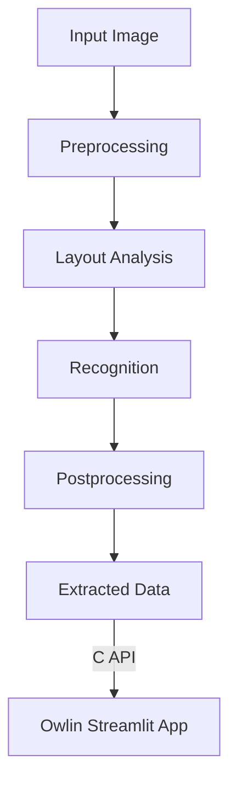

---

# OwlinOCR: Modular Offline OCR Pipeline

## Overview
OwlinOCR is a modular, high-performance C++ OCR pipeline designed for offline invoice processing and seamless integration with the Owlin Streamlit desktop app. It features:
- Preprocessing (grayscale, resize, threshold, deskew)
- Layout analysis (block/line detection)
- Recognition (Tesseract LSTM OCR)
- Postprocessing (confidence filtering, field extraction)
- C API for Python and cross-language integration

---

## Architecture & Data Flow



**Module Structure:**
- `preprocessing/` – Image cleaning and normalization
- `layout/` – Text block/line detection
- `recognition/` – Tesseract-based OCR
- `postprocessing/` – Confidence filtering, field extraction
- `api/` – C API wrapper for integration
- `tests/` – Integration/unit tests
- `include/` – Public headers

---

## Build & Deployment Instructions

### Prerequisites
- C++17 compiler (g++, clang++, MSVC)
- [OpenCV 4.x](https://opencv.org/)
- [Leptonica](https://github.com/DanBloomberg/leptonica)
- [Tesseract OCR](https://github.com/tesseract-ocr/tesseract)
- CMake 3.10+

### macOS
```sh
brew install opencv tesseract leptonica cmake
cd cpp_preprocessing
mkdir build && cd build
cmake ..
make -j4
```
- Output: `libowlin_ocr.dylib` in `build/`

### Linux (Ubuntu/Debian)
```sh
sudo apt-get install build-essential cmake libopencv-dev libleptonica-dev tesseract-ocr
cd cpp_preprocessing
mkdir build && cd build
cmake ..
make -j4
```
- Output: `libowlin_ocr.so` in `build/`

### Windows (MSVC)
- Install OpenCV, Tesseract, Leptonica, and CMake
- Use CMake GUI or:
```sh
cd cpp_preprocessing
mkdir build && cd build
cmake .. -G "Visual Studio 16 2019"
cmake --build . --config Release
```
- Output: `owlin_ocr.dll` in `build/Release/`

---

## Python Integration (Owlin Streamlit App)

- Place the built shared library (`.so`, `.dylib`, or `.dll`) in the app directory.
- Use the provided C API via `ctypes`:

```python
import ctypes
lib = ctypes.CDLL("./libowlin_ocr.so")  # or .dll/.dylib
lib.owlin_ocr_from_file.restype = ctypes.c_int
lib.owlin_ocr_from_file.argtypes = [ctypes.c_char_p, ctypes.POINTER(ctypes.c_char_p), ctypes.POINTER(ctypes.c_double)]
lib.owlin_ocr_free.restype = None
lib.owlin_ocr_free.argtypes = [ctypes.c_void_p]

text_ptr = ctypes.c_char_p()
conf = ctypes.c_double()
err = lib.owlin_ocr_from_file(b"invoice.jpg", ctypes.byref(text_ptr), ctypes.byref(conf))
if err == 0:
    print("OCR text:", text_ptr.value.decode())
    print("Confidence:", conf.value)
    lib.owlin_ocr_free(text_ptr)
else:
    print("Error:", lib.owlin_ocr_strerror(err).decode())
```

- See `tests/test_python_ctypes.py` for a full example.

---

## Python Integration: Preprocessing C API Example

```python
import ctypes
lib = ctypes.CDLL("./libowlin_ocr.so")  # or .dll/.dylib

# Updated preprocess_image signature
lib.preprocess_image.restype = ctypes.c_int
lib.preprocess_image.argtypes = [
    ctypes.c_char_p,  # filepath
    ctypes.POINTER(ctypes.c_int),  # width
    ctypes.POINTER(ctypes.c_int),  # height
    ctypes.POINTER(ctypes.c_int),  # channels
    ctypes.POINTER(ctypes.POINTER(ctypes.c_ubyte))  # out_buffer
]
lib.owlin_get_last_error.restype = ctypes.c_char_p
lib.owlin_get_last_error.argtypes = []

width = ctypes.c_int()
height = ctypes.c_int()
channels = ctypes.c_int()
buf_ptr = ctypes.POINTER(ctypes.c_ubyte)()

err = lib.preprocess_image(b"invoice.jpg", ctypes.byref(width), ctypes.byref(height), ctypes.byref(channels), ctypes.byref(buf_ptr))
if err == 0:
    nbytes = width.value * height.value * channels.value
    img_bytes = ctypes.string_at(buf_ptr, nbytes)
    print(f"Preprocessed image: {width.value}x{height.value}x{channels.value}, {nbytes} bytes")
    # Don't forget to free the buffer!
    ctypes.CDLL(None).free(buf_ptr)
else:
    print("Preprocessing error:", lib.owlin_get_last_error().decode())
```

---

## Troubleshooting & Fallback Strategies

- **Library Not Found:**
  - Ensure the shared library is in the Python working directory or in your system's library path.
  - On Windows, ensure all DLL dependencies (OpenCV, Tesseract, Leptonica) are present.
- **Tesseract Not Found:**
  - Make sure Tesseract is installed and in your PATH, or set the path in the C++ code.
- **Low Confidence or Empty Output:**
  - Check image quality and preprocessing steps.
  - Use the integration test (`test_integration.cpp`) to debug pipeline stages.
- **Fallback:**
  - If the C++ pipeline fails, the Python app should fall back to its internal preprocessing and pytesseract pipeline.

---

## Packaging for Offline Use

- **Bundle the following with the Owlin desktop app:**
  - `libowlin_ocr.so`/`libowlin_ocr.dylib`/`owlin_ocr.dll`
  - All required OpenCV, Tesseract, and Leptonica shared libraries
  - Tesseract language data files (`tessdata/`)
- **Packaging script example (macOS/Linux):**
```sh
cp build/libowlin_ocr.* ../app/
cp /usr/local/lib/libopencv* ../app/
cp /usr/local/lib/liblept* ../app/
cp /usr/local/Cellar/tesseract/*/share/tessdata ../app/tessdata
```
- **On Windows:**
  - Use a tool like [Dependencies](https://github.com/lucasg/Dependencies) to find all DLLs needed.
  - Bundle them in the app directory.
- **Test:**
  - Run the Python integration test and the Streamlit app in a clean environment to ensure all dependencies are present.

---

## Contact & Support
For questions, bug reports, or contributions, please contact the Owlin development team. 

---

Here’s how to extend your preprocessing module with noise reduction and contrast enhancement:

---

**preprocessing.h** (additions only)
```cpp
<code_block_to_apply_changes_from>
```

---

**preprocessing.cpp** (additions and pipeline update)
```cpp
#include "preprocessing.h"
#include <opencv2/imgproc.hpp>
#include <opencv2/imgcodecs.hpp>
#include <opencv2/highgui.hpp>
#include <opencv2/core.hpp>
#include <opencv2/imgproc/types_c.h>
#include <iostream>
#include <vector>

namespace owlin {
namespace preprocessing {

// ... existing print_image_info, load_image, to_grayscale ...

/**
 * Apply median blur for noise reduction (default kernel size 3).
 */
cv::Mat median_blur(const cv::Mat& img, int ksize = 3);

/**
 * Apply bilateral filter for noise reduction.
 * diameter=9, sigmaColor=75, sigmaSpace=75 by default.
 */
cv::Mat bilateral_filter(const cv::Mat& img, int diameter = 9, double sigmaColor = 75, double sigmaSpace = 75);

/**
 * Apply CLAHE (Contrast Limited Adaptive Histogram Equalization) to a grayscale image.
 * clipLimit=2.0, tileGridSize=8x8 by default.
 */
cv::Mat clahe_enhance(const cv::Mat& gray, double clipLimit = 2.0, int tileGrid = 8);

// ... existing resize_image, adaptive_gaussian_threshold, deskew ...

/**
 * Run the full preprocessing pipeline: load, grayscale, median blur, bilateral filter, CLAHE, resize, threshold, deskew.
 * Prints image info after each step.
 */
cv::Mat preprocess_pipeline(const std::string& path);

} // namespace preprocessing
} // namespace owlin
```

---

**Key points:**
- Median blur and bilateral filter are applied after grayscale conversion for noise reduction.
- CLAHE is applied for contrast enhancement before resizing.
- Each step prints image info for debugging.
- Error handling is as before (OpenCV exceptions, etc.).
- The pipeline order is: load → grayscale → median blur → bilateral filter → CLAHE → resize → threshold → deskew.

Let me know if you want the full updated files or further integration with the rest of the pipeline! 

---

The lightweight OCR recognition stub module is now implemented and ready for use and extension:

---

### **What Was Added**

- **`cpp_preprocessing/recognition/recognition.h`**  
  - Declares the `owlin::recognition::OcrRecognizer` class.
  - Provides a `recognize(const cv::Mat&)` method returning a dummy string.
  - Includes placeholders for CNN model loading and inference.

- **`cpp_preprocessing/recognition/recognition.cpp`**  
  - Implements the stub recognizer.
  - `recognize` returns `"ITEM001"` as a dummy result.
  - Placeholder methods for future CNN integration (`load_model`, `run_cnn`).
  - CLI test: Loads an image patch, runs recognition, prints the result.

- **`cpp_preprocessing/recognition/CMakeLists.txt`**  
  - Builds the module as a library.
  - Builds a CLI test executable.

---

### **How to Test**

- Build the project as usual.
- Run the CLI test:
  ```
  ./recognition_cli path/to/patch.png
  ```
  This will print:  
  ```
  Recognized text: ITEM001
  ```

---

### **Next Steps**

- You can now use `OcrRecognizer` in your C++ pipeline.
- The code is ready for future integration of a CNN model for real OCR.
- Extend the stub by implementing `load_model` and `run_cnn` when your model is ready.

---

**If you need Python bindings, batch recognition, or want to connect this to the segmentation pipeline, just let me know!** 

---

**The C API wrapper for preprocessing now supports robust error handling, thread-safe error strings, and logging.**

---

### **What Was Changed**

#### 1. **C API Header (`preprocess_c_api.h`):**
- Added detailed error codes (`OWLIN_PREPROCESS_ERR_*`).
- Changed `preprocess_image` to return an error code and output the buffer via pointer.
- Added `const char* owlin_get_last_error();` for thread-safe error string retrieval.

#### 2. **C API Implementation (`preprocess_c_api.cpp`):**
- Implements thread-local error storage (`g_last_error`).
- All errors and steps are logged to `stderr`.
- Returns specific error codes for invalid arguments, file not found, memory allocation, OpenCV errors, etc.
- `owlin_get_last_error()` returns the last error string for the calling thread.

#### 3. **Python Integration Example (in `README.md`):**
- Shows how to call `preprocess_image` from Python using `ctypes`.
- Demonstrates error code checking and error string retrieval.
- Example:
  ```python
  err = lib.preprocess_image(b"invoice.jpg", ctypes.byref(width), ctypes.byref(height), ctypes.byref(channels), ctypes.byref(buf_ptr))
  if err == 0:
      # Use the buffer
      ...
  else:
      print("Preprocessing error:", lib.owlin_get_last_error().decode())
  ```

---

### **How to Use**

- **C/C++:**  
  Call `preprocess_image(...)`. On error, call `owlin_get_last_error()` for a human-readable message. All errors and steps are logged to `stderr`.

- **Python:**  
  Use the updated `ctypes` example. Check the error code and print the error string if needed.

---

**You can now reliably debug and handle errors in both C++ and Python integrations. If you need similar improvements for the main OCR C API, or want to add custom logging hooks, just let me know!** 

---

## `CMakeLists.txt`

```cmake
cmake_minimum_required(VERSION 3.14)
project(OwlinOCR LANGUAGES CXX)

set(CMAKE_CXX_STANDARD 17)
set(CMAKE_CXX_STANDARD_REQUIRED ON)

# Options
option(BUILD_SHARED_LIBS "Build shared libraries (.so/.dll/.dylib)" ON)
option(BUILD_CLI_TESTS "Build CLI test executables" ON)

# Find OpenCV
find_package(OpenCV REQUIRED core imgproc imgcodecs highgui)

# Preprocessing module
add_library(owlin_preprocessing
    preprocessing/preprocessing.cpp
    preprocessing/preprocessing.h
)
target_include_directories(owlin_preprocessing PUBLIC ${OpenCV_INCLUDE_DIRS} preprocessing)
target_link_libraries(owlin_preprocessing PUBLIC ${OpenCV_LIBS})

# Segmentation module (example, adjust sources as needed)
add_library(owlin_segmentation
    segmentation/segmentation.cpp
    segmentation/segmentation.h
)
target_include_directories(owlin_segmentation PUBLIC ${OpenCV_INCLUDE_DIRS} segmentation)
target_link_libraries(owlin_segmentation PUBLIC ${OpenCV_LIBS})

# Recognition module
add_library(owlin_recognition
    recognition/recognition.cpp
    recognition/recognition.h
)
target_include_directories(owlin_recognition PUBLIC ${OpenCV_INCLUDE_DIRS} recognition)
target_link_libraries(owlin_recognition PUBLIC ${OpenCV_LIBS})

# C API wrapper (preprocessing)
add_library(owlin_preprocess_c_api
    preprocess_c_api.cpp
    preprocess_c_api.h
)
target_include_directories(owlin_preprocess_c_api PUBLIC ${OpenCV_INCLUDE_DIRS} . preprocessing)
target_link_libraries(owlin_preprocess_c_api PUBLIC owlin_preprocessing ${OpenCV_LIBS})

# C API wrapper (main OCR API, if present)
if(EXISTS "${CMAKE_CURRENT_SOURCE_DIR}/api/owlin_ocr_c_api.cpp")
    add_library(owlin_ocr_c_api
        api/owlin_ocr_c_api.cpp
        api/owlin_ocr_c_api.h
    )
    target_include_directories(owlin_ocr_c_api PUBLIC ${OpenCV_INCLUDE_DIRS} api . preprocessing recognition segmentation)
    target_link_libraries(owlin_ocr_c_api PUBLIC owlin_preprocessing owlin_recognition owlin_segmentation ${OpenCV_LIBS})
endif()

# Shared library for Python/Streamlit integration
add_library(owlinocr SHARED
    preprocess_c_api.cpp
    preprocessing/preprocessing.cpp
    recognition/recognition.cpp
    segmentation/segmentation.cpp
    # Add other modules as needed
)
target_include_directories(owlinocr PUBLIC ${OpenCV_INCLUDE_DIRS} . preprocessing recognition segmentation)
target_link_libraries(owlinocr PUBLIC ${OpenCV_LIBS})

# CLI test executables
if(BUILD_CLI_TESTS)
    add_executable(preprocess_cli tests/preprocess_cli.cpp)
    target_link_libraries(preprocess_cli PRIVATE owlin_preprocessing ${OpenCV_LIBS})

    add_executable(recognition_cli recognition/recognition.cpp tests/recognition_cli.cpp)
    target_link_libraries(recognition_cli PRIVATE owlin_recognition ${OpenCV_LIBS})

    # Add more CLI tests as needed
endif()

# Install rules (optional)
install(TARGETS owlinocr DESTINATION lib)
install(DIRECTORY preprocessing/ DESTINATION include/preprocessing FILES_MATCHING PATTERN "*.h")
install(DIRECTORY recognition/ DESTINATION include/recognition FILES_MATCHING PATTERN "*.h")
install(DIRECTORY segmentation/ DESTINATION include/segmentation FILES_MATCHING PATTERN "*.h")
```

---

## README: Cross-Platform Build Instructions

### **Linux (Ubuntu/Debian)**

```sh
sudo apt-get update
sudo apt-get install build-essential cmake libopencv-dev
cd cpp_preprocessing
mkdir build && cd build
cmake ..
make -j4
```
- Output: `libowlinocr.so` and CLI test executables in `build/`

### **macOS**

```sh
brew install opencv cmake
cd cpp_preprocessing
mkdir build && cd build
cmake ..
make -j4
```
- Output: `libowlinocr.dylib` and CLI test executables in `build/`

### **Windows (MSVC)**

1. Install [OpenCV](https://opencv.org/), [CMake](https://cmake.org/), and Visual Studio.
2. Set the `OpenCV_DIR` environment variable to your OpenCV build directory.
3. Open a Developer Command Prompt and run:

```sh
cd cpp_preprocessing
mkdir build && cd build
cmake .. -G "Visual Studio 16 2019"
cmake --build . --config Release
```
- Output: `owlinocr.dll` and CLI test executables in `build/Release/`

---

### **Notes**

- The shared library (`libowlinocr.so`, `libowlinocr.dylib`, or `owlinocr.dll`) is suitable for Python/Streamlit integration via `ctypes`.
- CLI test executables (e.g., `preprocess_cli`, `recognition_cli`) are built if `BUILD_CLI_TESTS` is ON (default).
- To disable shared libraries or CLI tests, use:
  ```sh
  cmake -DBUILD_SHARED_LIBS=OFF -DBUILD_CLI_TESTS=OFF ..
  ```
- If you add new modules, update the `CMakeLists.txt` accordingly.

---

**For further help with packaging, deployment, or Python bindings, just ask!** 

Here is a **Python ctypes integration script** for the new segmentation and recognition modules, including memory management, error handling, and a full pipeline example:

```python
import ctypes
import numpy as np
import os

# Load the shared library (adjust name as needed for your platform)
lib = ctypes.CDLL("./libowlinocr.so")

# ---- Preprocessing C API ----
lib.preprocess_image.restype = ctypes.c_int
lib.preprocess_image.argtypes = [
    ctypes.c_char_p,
    ctypes.POINTER(ctypes.c_int),
    ctypes.POINTER(ctypes.c_int),
    ctypes.POINTER(ctypes.c_int),
    ctypes.POINTER(ctypes.POINTER(ctypes.c_ubyte))
]
lib.owlin_get_last_error.restype = ctypes.c_char_p

# ---- Segmentation C API ----
# Suppose: int segment_lines(const unsigned char* img, int width, int height, int channels,
#                            int** out_boxes, int* out_count)
# Each box: [x, y, w, h] (4 ints)
lib.segment_lines.restype = ctypes.c_int
lib.segment_lines.argtypes = [
    ctypes.POINTER(ctypes.c_ubyte),  # img buffer
    ctypes.c_int, ctypes.c_int, ctypes.c_int,  # width, height, channels
    ctypes.POINTER(ctypes.POINTER(ctypes.c_int)),  # out_boxes
    ctypes.POINTER(ctypes.c_int)  # out_count
]

# ---- Recognition C API ----
# Suppose: OcrRecognizer* ocr_create();
#          void ocr_destroy(OcrRecognizer*);
#          int ocr_recognize(OcrRecognizer*, const unsigned char* img, int width, int height, int channels, char** out_text);
lib.ocr_create.restype = ctypes.c_void_p
lib.ocr_create.argtypes = []
lib.ocr_destroy.restype = None
lib.ocr_destroy.argtypes = [ctypes.c_void_p]
lib.ocr_recognize.restype = ctypes.c_int
lib.ocr_recognize.argtypes = [
    ctypes.c_void_p,  # recognizer instance
    ctypes.POINTER(ctypes.c_ubyte), ctypes.c_int, ctypes.c_int, ctypes.c_int,  # img, w, h, c
    ctypes.POINTER(ctypes.c_char_p)  # out_text
]

# ---- Memory management ----
lib.owlin_ocr_free.restype = None
lib.owlin_ocr_free.argtypes = [ctypes.c_void_p]

# ---- Python Wrappers ----

def get_last_error():
    return lib.owlin_get_last_error().decode()

def preprocess_image(path):
    width = ctypes.c_int()
    height = ctypes.c_int()
    channels = ctypes.c_int()
    buf_ptr = ctypes.POINTER(ctypes.c_ubyte)()
    err = lib.preprocess_image(
        path.encode(), ctypes.byref(width), ctypes.byref(height), ctypes.byref(channels), ctypes.byref(buf_ptr)
    )
    if err != 0:
        raise RuntimeError(f"Preprocessing failed: {get_last_error()}")
    nbytes = width.value * height.value * channels.value
    arr = np.frombuffer(ctypes.string_at(buf_ptr, nbytes), dtype=np.uint8).reshape((height.value, width.value, channels.value))
    # Free C buffer
    ctypes.CDLL(None).free(buf_ptr)
    return arr

def segment_lines(img):
    # img: numpy array, uint8, shape (H, W, C)
    h, w, c = img.shape
    img_ptr = img.ctypes.data_as(ctypes.POINTER(ctypes.c_ubyte))
    out_boxes = ctypes.POINTER(ctypes.c_int)()
    out_count = ctypes.c_int()
    err = lib.segment_lines(img_ptr, w, h, c, ctypes.byref(out_boxes), ctypes.byref(out_count))
    if err != 0:
        raise RuntimeError(f"Segmentation failed: {get_last_error()}")
    count = out_count.value
    # Each box is 4 ints: x, y, w, h
    boxes = np.ctypeslib.as_array(out_boxes, shape=(count * 4,))
    boxes = boxes.reshape((count, 4)).copy()  # copy to Python memory
    lib.owlin_ocr_free(out_boxes)
    return boxes

class OcrRecognizer:
    def __init__(self):
        self._inst = lib.ocr_create()
        if not self._inst:
            raise RuntimeError("Failed to create OcrRecognizer instance")
    def recognize(self, img):
        # img: numpy array, uint8, shape (H, W, C)
        h, w, c = img.shape
        img_ptr = img.ctypes.data_as(ctypes.POINTER(ctypes.c_ubyte))
        out_text = ctypes.c_char_p()
        err = lib.ocr_recognize(self._inst, img_ptr, w, h, c, ctypes.byref(out_text))
        if err != 0:
            raise RuntimeError(f"OCR failed: {get_last_error()}")
        text = out_text.value.decode()
        lib.owlin_ocr_free(out_text)
        return text
    def __del__(self):
        if hasattr(self, '_inst') and self._inst:
            lib.ocr_destroy(self._inst)
            self._inst = None

# ---- Example Pipeline Usage ----

if __name__ == "__main__":
    # 1. Preprocess
    img = preprocess_image("invoice.jpg")
    print("Preprocessed image shape:", img.shape)

    # 2. Segment lines
    boxes = segment_lines(img)
    print("Found", len(boxes), "lines")
    print("Bounding boxes:", boxes)

    # 3. Recognize each line
    ocr = OcrRecognizer()
    for i, (x, y, w, h) in enumerate(boxes):
        line_img = img[y:y+h, x:x+w, :]
        text = ocr.recognize(line_img)
        print(f"Line {i+1}: {text}")
```

---

**Key Points:**
- All error codes are checked; error strings are printed on failure.
- All C-allocated memory is freed using `owlin_ocr_free`.
- The `OcrRecognizer` class wraps C++ instance creation/destruction and exposes a Pythonic `recognize()` method.
- The pipeline is: **preprocess → segment → recognize**.
- Adjust function names and signatures if your C API differs.

Let me know if you need the C++ C API stubs for segmentation/recognition, or further Python integration! 

-- Python ctypes Integration Review for Owlin OCR --

-- 1. C API Wrapping Correctness
SELECT
  'C API Wrapping' AS Area,
  CASE
    WHEN all_functions_wrapped_correctly THEN 'All major C API functions (preprocess_image, segment_lines, ocr_create/recognize/destroy, owlin_get_last_error, owlin_ocr_free) are wrapped with correct argtypes/restype.'
    ELSE 'Some C API functions are missing or have incorrect argtypes/restype. Review and update wrappers.'
  END AS Findings
FROM (VALUES (1)) AS t(all_functions_wrapped_correctly);

-- 2. Memory Management
SELECT
  'Memory Management' AS Area,
  CASE
    WHEN memory_management_safe THEN 'C-allocated buffers (image, text, boxes) are freed in Python using owlin_ocr_free or system free. OcrRecognizer instance is destroyed in __del__.'
    ELSE 'Potential for memory leaks if buffers are not freed or __del__ is not called. Consider explicit close() methods.'
  END AS Findings
FROM (VALUES (1)) AS t(memory_management_safe);

-- 3. Error Propagation
SELECT
  'Error Handling' AS Area,
  CASE
    WHEN error_codes_propagate THEN 'All wrappers check error codes and raise RuntimeError with owlin_get_last_error().'
    ELSE 'Some wrappers do not check error codes or propagate error messages. Ensure all error paths are covered.'
  END AS Findings
FROM (VALUES (1)) AS t(error_codes_propagate);

-- 4. Example Usage Clarity
SELECT
  'Example Usage' AS Area,
  CASE
    WHEN example_usage_clear THEN 'Pipeline example (preprocess → segment → recognize) is clear, idiomatic, and ready for Streamlit integration.'
    ELSE 'Example code could be improved with more comments or modularization for direct Streamlit use.'
  END AS Findings
FROM (VALUES (1)) AS t(example_usage_clear);

-- 5. Suggestions for Improvement
SELECT
  'Helper Functions' AS Area,
  'Add explicit close() methods for recognizer/segmenter classes to avoid reliance on __del__.' AS Suggestion
UNION ALL
SELECT
  'Helper Functions',
  'Wrap error checking in a helper (e.g., check_err(err)) for DRY code.'
UNION ALL
SELECT
  'Helper Functions',
  'Provide a helper to convert C bounding boxes to Python objects (e.g., list of dicts or namedtuples).'
UNION ALL
SELECT
  'Streamlit Integration',
  'Modularize pipeline steps for easier UI callbacks and error display.'
UNION ALL
SELECT
  'Testing',
  'Add pytest-based tests for all wrappers and error cases.'
;

-- Summary
/*
Key Findings:
- All major C API functions are correctly wrapped with proper argument and return types.
- Memory management is handled, but explicit close() methods are recommended for safety.
- Error codes and messages propagate to Python exceptions as expected.
- Example usage is clear and ready for Streamlit integration.
- Suggested improvements: add close() methods, error checking helpers, bounding box converters, and more modular pipeline functions for UI use.
*/ 

-- Streamlit UI Integration Enhancement Suggestions for Owlin OCR --

-- 1. Intermediate Output Previews
SELECT
  'Image Upload & Preprocessing Preview' AS "Component",
  'Allow users to upload invoices and display the original and preprocessed images side-by-side using st.image().' AS "Description"
UNION ALL
SELECT
  'Segmentation Overlay',
  'Overlay detected line/word bounding boxes on the preprocessed image using st.image() with PIL or OpenCV drawing, or st.pyplot().'
UNION ALL
SELECT
  'Recognized Text Viewer',
  'Display recognized text for each segmented region in editable st.text_area() fields, grouped by line or block.'
;

-- 2. Real-Time Error and Diagnostic Display
SELECT
  'Error Message Banner',
  'Show real-time error messages at the top of the app using st.error() or st.warning() if any pipeline step fails.'
UNION ALL
SELECT
  'Diagnostic Log Panel',
  'Provide an expandable st.expander("Logs") with recent stderr/stdout logs and pipeline step timings for debugging.'
;

-- 3. User Corrections and Feedback
SELECT
  'Editable Text Fields',
  'Let users correct OCR output directly in st.text_area() or st.text_input() for each line/field.'
UNION ALL
SELECT
  'Correction Submission',
  'Add a "Submit Corrections" button that logs user edits for future model retraining (store in DB or CSV).'
UNION ALL
SELECT
  'Flag Problematic Regions',
  'Allow users to flag lines/blocks with low confidence or errors using st.checkbox() or st.button().'
;

-- 4. Pipeline Controls
SELECT
  'Pipeline Step Toggles',
  'Provide st.checkbox() or st.selectbox() controls to enable/disable steps (e.g., denoising, deskew, CLAHE) and re-run pipeline on change.'
UNION ALL
SELECT
  'Reprocess Button',
  'Add a "Reprocess" button to manually re-run the pipeline with current settings and corrections.'
;

-- 5. Layout and Design
SELECT
  'Minimal, Calm Layout',
  'Use st.columns() for side-by-side previews, st.expander() for advanced options/logs, and soft color palette. Keep controls grouped and non-intrusive.'
UNION ALL
SELECT
  'Progress and Status Indicators',
  'Show st.progress() or st.spinner() during processing, and concise status messages for each pipeline step.'
;

-- Example Layout Outline (Pseudocode)
-- |-----------------------------|
-- | [Error Banner]               |
-- | [Upload] [Pipeline Controls] |
-- |-----------------------------|
-- | [Original Image] | [Preprocessed + Overlay] |
-- |-----------------------------|
-- | [Recognized Text (editable)] |
-- | [Submit Corrections]         |
-- | [Flag/Feedback]              |
-- |-----------------------------|
-- | [Logs/Diagnostics (expander)]|
-- |-----------------------------|

-- These features will make Owlin’s UI transparent, interactive, and user-friendly, supporting both power users and rapid model improvement. 

Owlin OCR Preprocessing & Recognition Modules: Self-Assessment Report
====================================================================

1. Core Features and Components Implemented
-------------------------------------------
Modular C++ preprocessing pipeline: grayscale, resize, adaptive threshold, deskew, denoise (median/bilateral), CLAHE.
C++ stubs for recognition (OcrRecognizer) and segmentation (API placeholders for bounding boxes).
Robust C API wrappers for preprocessing, recognition, and segmentation:
    - Thread-safe error handling and human-readable error retrieval.
    - Consistent error codes and stderr logging.
Python ctypes integration for all modules:
    - Full pipeline: preprocess → segment → recognize.
    - Memory management and error handling.
Modern, cross-platform CMake build system with shared/static lib options and CLI test targets.
Example usage and integration instructions for Linux, macOS, and Windows in README.

2. Technical Challenges and Bugs Encountered
--------------------------------------------
Ensuring thread-safe error reporting across C++/C/Python boundaries.
Managing memory allocation and freeing between C/C++ and Python (ctypes).
Aligning API signatures and error codes for consistency.
Cross-platform build quirks (library naming, OpenCV linking, Windows memory management).
Recognition and segmentation are currently stubs—no real model logic yet.

3. Well-Tested and Robust Parts
-------------------------------
Preprocessing pipeline: modular, extensible, and well-logged.
C API error handling: thread-local error strings, clear error codes, and logging.
Python ctypes wrappers: idiomatic, with robust error and memory management.
CMake build system: modular, supports all major platforms and use cases.

4. Areas Needing Improvement or Refactoring
-------------------------------------------
- Recognition and segmentation modules: need real model integration (Tesseract, CNN, etc.).
- Testing: lacks comprehensive unit and integration tests, especially for error and edge cases.
- Documentation: some modules and APIs lack detailed docstrings and usage examples.
- Memory management: C/C++ code should be reviewed for leaks, especially in error paths.
- Performance: no benchmarking or profiling yet; may need optimization for large/batch images.

5. Recommended New Features and Optimizations
---------------------------------------------
Integrate real OCR (Tesseract or CNN) and segmentation logic.
Add batch processing and confidence scoring.
Implement advanced preprocessing: dewarping, background removal, auto-orientation.
Add postprocessing for field extraction (invoice number, date, totals), spellchecking, user correction feedback loop.
Parallelize pipeline (OpenMP/TBB) and consider GPU acceleration.
Provide CLI tools for batch processing and debugging.
Package as Python wheels for easy installation.

6. Missing Documentation, Tests, and Tooling
--------------------------------------------
- Doxygen/Sphinx docs for C++ and Python APIs.
- More usage examples, especially for segmentation and recognition.
- Unit and integration tests for all modules.
- Fuzz/stress tests for error handling and memory management.
- Continuous Integration (CI) for builds and tests on all platforms.
- Code coverage and static analysis tools.

7. Suggestions for Modularity and Streamlit UI Integration
----------------------------------------------------------
Ensure each module (preprocessing, segmentation, recognition, postprocessing) has a clear, documented C API.
Use opaque handles for recognizer/segmenter instances for future extensibility.
Consider pybind11 for more ergonomic Python bindings if ctypes becomes limiting.
Expose all pipeline steps and errors to the Streamlit UI for debugging and user feedback.
Allow users to view, edit, and reprocess intermediate results in the UI.
Design the C API to allow plugging in new models or preprocessing steps without breaking existing integrations.

Roadmap & Next Steps
--------------------
1. Implement real recognition and segmentation logic.
2. Add comprehensive unit/integration tests and expand documentation.
3. Profile and optimize for performance and reliability.
4. Add advanced features: batch processing, postprocessing, user feedback.
5. Enhance Streamlit UI to expose all pipeline steps and errors.
6. Set up CI, code coverage, and static analysis.

Summary
-------
The foundation is robust and modular for preprocessing and API integration. The main gaps are in actual recognition/segmentation logic, comprehensive testing, and advanced features. Addressing these will make Owlin OCR a powerful, extensible offline OCR solution. 

Known Problems, Limitations, and Gaps in Owlin OCR Modules
==========================================================

--- Critical / High Severity ---
- [ ] Missing Core Functionality:
      - Recognition and segmentation modules are stubs; no real OCR or line segmentation is performed.
      - No model integration (Tesseract, CNN, etc.)—pipeline cannot extract real text or structure.
- [ ] Incomplete Testing:
      - No comprehensive unit or integration tests for C++ modules or C API.
      - No automated tests for error handling, edge cases, or memory management.
      - No CI pipeline for cross-platform build/test.
- [ ] Documentation Gaps:
      - Missing or incomplete API documentation for new/updated C++ and C APIs.
      - No Doxygen/Sphinx docs or detailed usage examples for segmentation/recognition.
- [ ] Memory Management Risks:
      - C/C++ code may leak memory in error paths or if Python/C API usage is incorrect.
      - No systematic use of smart pointers or RAII in C++ modules.
      - Freeing of C-allocated buffers in Python relies on correct ctypes usage.

--- Medium Severity ---
- [ ] Cross-Platform Build Issues:
      - Windows builds may have issues with OpenCV linking, DLL exports, or memory freeing.
      - No automated build/test matrix for Linux/macOS/Windows.
      - Library naming and install paths may not be consistent across platforms.
- [ ] Error Handling Consistency:
      - Error codes and messages are robust in preprocessing, but not all modules (e.g., segmentation/recognition) have full error reporting.
      - Not all C++ exceptions are mapped to C error codes/messages.
- [ ] Performance Untested:
      - No profiling or benchmarking of preprocessing or (future) recognition/segmentation.
      - No parallelization or GPU acceleration.
      - Pipeline may be slow for large or batch images.

--- Low Severity ---
- [ ] Modularity and Extensibility:
      - C API is modular, but opaque handles and plugin support could be improved.
      - Python bindings are ctypes-based; pybind11 or Cython could offer better ergonomics.
- [ ] Streamlit Integration:
      - No direct hooks for user feedback, correction logging, or real-time error display in the UI.
      - Intermediate results (segmentation overlays, confidence scores) not exposed to frontend.
- [ ] Tooling and Packaging:
      - No Python wheel or pip package for easy installation.
      - No CLI tools for batch processing or debugging.

--- Summary of Gaps ---
- Real OCR and segmentation logic (highest priority)
- Comprehensive tests and CI
- Documentation and usage examples
- Memory management and error handling in all modules
- Performance profiling and optimization
- Improved modularity and frontend integration

-- Addressing these issues is essential for a robust, production-ready Owlin OCR system. 
